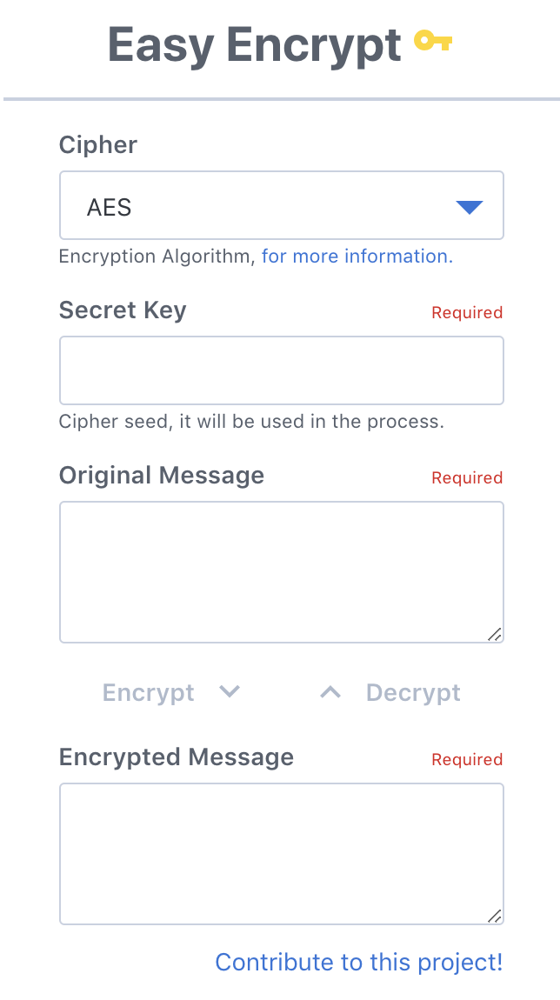
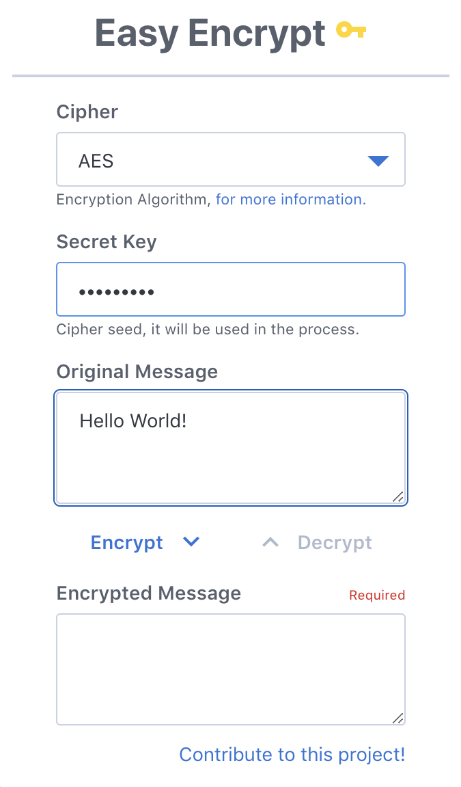
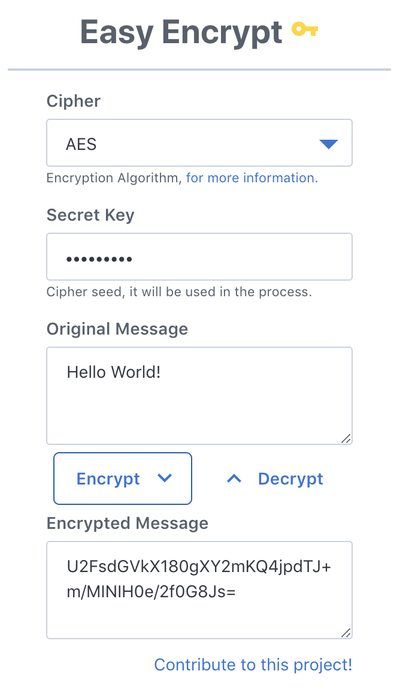

# chrome-easy-decrypt

<div align="center">
    
</div>

> Open Source Chrome extension to encrypt and decrypt a message in seconds!

[Link to the store](https://chrome.google.com/webstore/detail/pdpinaffkgjneengfdgoohjipndeopcn)

## Technical Overview

This extension was bootstrapped with [Create React App](https://github.com/facebookincubator/create-react-app), which helps a lot in development due to all the great features it has!

I choose [`mineral-ui`](http://mineral-ui.com/) for all the React components: `Button`, `Select`, `TextField`, and many more ... So if you like how they look please go and check their documentation which is awesome!

And at last, to encrypt/decrypt a message I use [`crypto-js`](https://github.com/brix/crypto-js) because it provides a total of 7 ciphers so the user can easily decide which suits best for him.

## Setup

```bash
# install deps
> yarn

# start project
> yarn start

# run lint
> yarn lint
```

## Screenshots

|        Main Page        | Filling Required fields |       Encrypted!        |
| :---------------------: | :---------------------: | :---------------------: |
|  |  |  |

## License

MIT © Emanuel Suriano – [@Emasuriano](https://twitter.com/emasuriano) – emanuel.suriano@gmail.com

## Contributing

1. Fork it (<https://github.com/EmaSuriano/chrome-easy-decrypt/fork>)
2. Create your feature branch (`git checkout -b feature/fooBar`)
3. Commit your changes (`git commit -am 'Add some fooBar'`)
4. Push to the branch (`git push origin feature/fooBar`)
5. Create a new Pull Request
